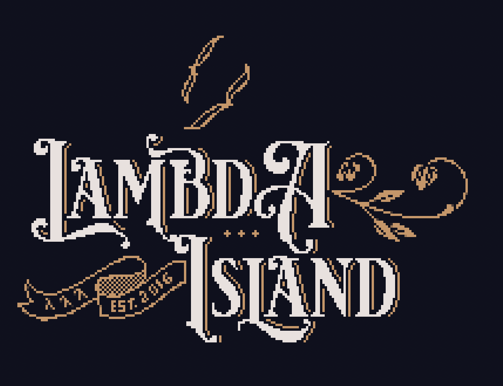

# Lambda Island Open Source

Lambda Island Open Source is a collection of Clojure/ClojureScript libraries and
tools created by the same people who brought you [Lambda Island
Education](https://lambdaisland.com).

Look at the [RELEASES file](RELEASES.md) to see what we've been up to.

## Project Overview

### Kaocha


Kaocha is our flagship project, a test runner for the future. Easy to use, rich
in features, extensible, and built with tooling in mind.

Kaocha is actually a collection of projects, which includes kaocha-cljs,
kaocha-junit-xml, kaocha-cloverage, kaocha-cucumber, and kaocha-boot.

[project site](https://github.com/lambdaisland/kaocha) | [releases](https://github.com/lambdaisland/kaocha/releases)

### Corgi

Corgi is a unbundled vim-style Emacs configuration for Clojure developers and
teams. It provides a great Clojure development experience out of the box. By
being minimal and having reproducibel installs it has good performance and is
uber-stable, while still leaving room for customization by the user.

[project site](https://github.com/corgi-emacs/corgi) | [releases](https://github.com/corgi-emacs/corgi/releases)

### Ornament

CSS-in-Clj(s). Create styled components in your Clojure or ClojureScript code,
which compile to plain CSS files and Hiccup/Reagent style component functions.
Keep your styling and markup separated but co-located. Works with Garden CSS
syntax, or with Tailwind-style utility classes.

[project site](https://github.com/lambdaisland/ornament) | [releases](https://github.com/lambdaisland/ornament/releases)

### lambdaisland/hiccup

Our take on the Hiccup templating syntax for writing HTML inside Clojure.
Provides escaping by default to prevent cross site scripting attacks, and
supports fragments (`:<>`) and functions-as-components, just like Reagent. This
library is clojure (backend) only, but can help to write cross-platform
components by supporting some of the same Hiccup extensions as Reagent. Pairs
well with Ornament.

[project site](https://github.com/lambdaisland/hiccup) | [releases](https://github.com/lambdaisland/hiccup/releases)

### deep-diff2

Deep-diff is our most downloaded project, it compares Clojure data structures
and gives an easy to scan visual overview of the differences. This is a spin-off
from Kaocha, where it is used to provide clearer error messages when tests fail.

[project site](https://github.com/lambdaisland/deep-diff2) | [releases](https://github.com/lambdaisland/deep-diff2/releases)

### Facai

Test factories for fun and profit. Gongxi Facai!

[project site](https://github.com/lambdaisland/facai) | [releases](https://github.com/lambdaisland/facai/releases)

### Faker

Port of the Faker Ruby gem, generate dummy values for your tests, factories, or
UI demos.

[project site](https://github.com/lambdaisland/faker) | [releases](https://github.com/lambdaisland/faker/releases)

### Regal


_still in alpha_

Regal is Clojure's ultimate regular expression library. It provides a
Hiccup-like syntax for regular expression, and eases the burden of writing
cross-platform code. With its support for string generation it pairs wonderfully
with generative testing, and its parser can be used to manipulate regular
expressions as data, and to convert between Java and JavaScript regexes.

[project site](https://github.com/lambdaisland/regal) | [releases](https://github.com/lambdaisland/regal/releases)

### lambdaisland/uri

A idiomatic and cross-platform URI library. RFC-compliant to the dot, it also
contains helpers for normalization, and for manipulating query strings.

[project site](https://github.com/lambdaisland/uri) | [releases](https://github.com/lambdaisland/uri/releases)

### lambdaisland/classpath

Classpath/classloader/deps.edn related utilities. Inspect the current
classloader stack, manipulate the classpath, and provide hot-reloading for
deps.edn.

[project site](https://github.com/lambdaisland/classpath) | [releases](https://github.com/lambdaisland/classpath/releases)

### Glogi

A ClojureScript logging library based on `goog.log`, inspired by `pedestal.log`.
It does syntax highlighting, plays well with cljs-devtools, and allows tweaking
the log level per namespace.

[project site](https://github.com/lambdaisland/glogi) | [releases](https://github.com/lambdaisland/glogi/releases)

### ANSI

Convert ANSI escape codes (the ones used to provide color in terminal
applications), and convert to Hiccup. Valuable if you're putting anything
Terminal-based onto the web.

[project site](https://github.com/lambdaisland/ansi) | [releases](https://github.com/lambdaisland/ansi/releases)

### Chui

_still in alpha_

A browser-based ClojureScript test runner with a delightful UI, built with
auto-reload workflows in mind.

[project site](https://github.com/lambdaisland/chui) | [releases](https://github.com/lambdaisland/chui/releases)

### Funnel

Funnel is a WebSocket message relay. It accepts connections from multiple
clients, and then acts as a go-between, funneling messages between them, with
flexible mechanisms for setting up message routing. It also provides
discoverability, so clients can find out who is there to talk to.

[project site](https://github.com/lambdaisland/funnel) | [releases](https://github.com/lambdaisland/funnel/releases)

### funnel-client

Clojure and ClojureScript client implementations, to make it easy to build funnel-based tools.

[project site](https://github.com/lambdaisland/funnel-client) | [rel-clienteases](https://github.com/lambdaisland/funnel-client/rel-clienteases)

### edn-lines

Read/write newline-separated EDN files.

[project site](https://github.com/lambdaisland/edn-lines) | [releases](https://github.com/lambdaisland/edn-lines/releases)

### lambdaisland/fetch

An idiomatic, promises-based wrapped for JavaScript's `fetch`.

[project site](https://github.com/lambdaisland/fetch) | [releases](https://github.com/lambdaisland/fetch/releases)

### lambdaisland/deja-fu

Lightweight and idiomatic ClojureScript local time/date library 

[project site](https://github.com/lambdaisland/deja-fu) | [releases](https://github.com/lambdaisland/deja-fu/releases)

### lambdaisland/data-printers

Define print handlers for custom or third party types easily. Cross platform and with support for multiple printing backends.

[project site](https://github.com/lambdaisland/data-printers) | [releases](https://github.com/lambdaisland/data-printers/releases)

### lambdaisland/dom-type

Implement print handlers (through data-printers) for various JavaScript types.
This way instead of printing `#object[HTMLElement]` you'll get `#js/Element
[:div "hello"]`.

[project site](https://github.com/lambdaisland/dom-types) | [releases](https://github.com/lambdaisland/dom-types/releases)

### Shellutils

Globbing and other shell/file utils

[project site](https://github.com/lambdaisland/shellutils) | [releases](https://github.com/lambdaisland/shellutils/releases)

### lambdaisland/daedalus

2D pathfinding for ClojureScript, primarily for use in games. A wrapper around hxDaedalus-js.

[project site](https://github.com/lambdaisland/daedalus) | [releases](https://github.com/lambdaisland/daedalus/releases)

### Puck

Wrapper for the Pixi.js rendering library, and other game development utilities.

[project site](https://github.com/lambdaisland/puck) | [releases](https://github.com/lambdaisland/puck/releases)

### lambdaisland/cljbox2d

_still in alpha_

2D physics engine API, Uses jBox2D on Clojure, and Planck.js on ClojureScript.

[project site](https://github.com/lambdaisland/cljbox2d) | [releases](https://github.com/lambdaisland/cljbox2d/releases)

### Witchcraft

A Clojure API and Plugin for Bukkit-based Minecraft server. Manipulate the Minecraft world from a REPL.

[project site](https://github.com/lambdaisland/witchcraft) | [releases](https://github.com/lambdaisland/witchcraft/releases)
[plugin site](https://github.com/lambdaisland/witchcraft-plugin) | [plugin releases](https://github.com/lambdaisland/witchcraft-plugin/releases)

### reitit-jaatya

Build a static site based on your reitit routes.

[project site](https://github.com/lambdaisland/reitit-jaatya) | [releases](https://github.com/lambdaisland/reitit-jaatya/releases)

### Embedkit

Turn Metabase into a dashboard engine. Provides an idempotent API for
programatically creating dashboards in Metabase and embedding them inside your
application.

[project site](https://github.com/lambdaisland/embedkit) | [releases](https://github.com/lambdaisland/embedkit/releases)

### metabase-datomic

A Datomic database connector for Metabase. This was created before Datomic
Analytics, and so no longer actively maintained. You can use Datomic Analytics
and Presto/Trino to connect to Metabase instead. That said it can still provide
some benefits because it supports some Datomic features directly, or can serve
as a basis for implementing connectors for other Datalog databases.

[project site](https://github.com/lambdaisland/metabase-datomic) | [releases](https://github.com/lambdaisland/metabase-datomic/releases)

### nREPL-proxy

Proxy server for debugging nREPL messages.

[project site](https://github.com/lambdaisland/nrepl-proxy) | [releases](https://github.com/lambdaisland/nrepl-proxy/releases)

### Specmonstah-Malli

_still in alpha_

Generated complex graphs of entities with Specmonstah and Malli.

[project site](https://github.com/lambdaisland/specmonstah-malli) | [releases](https://github.com/lambdaisland/specmonstah-malli/releases)

### Trikl

_still in alpha_

Build rich terminal applications with Hiccup. An ongoing research project.

[project site](https://github.com/lambdaisland/trikl) | [releases](https://github.com/lambdaisland/trikl/releases)

### zipper-viz

_still in alpha_

Visualize Clojure.zip zippers with graphviz.

[project site](https://github.com/lambdaisland/zipper-viz) | [releases](https://github.com/lambdaisland/zipper-viz/releases)

### Garden-watcher

Component to watch Garden namespaces for changes, and recompile them to CSS on the fly.

[project site](https://github.com/lambdaisland/garden-watcher) | [releases](https://github.com/lambdaisland/garden-watcher/releases)

## Style Guide and Project Setup

We have a [style guide](https://nextjournal.com/lambdaisland/clojure-style-guide) that applies to all of our projects.

Our preferred open source/free software license is the Mozilla Public License
v2.0 (a less intrusive copyleft license), although some of our projects still
use the Eclipse Public License.

We prefer Clojure CLI over Leiningen, although some projects may still use
`project.clj` instead of `deps.edn`.

We like to run our tests through Kaocha on CircleCI.

## Code of Conduct

All our projects are covered by the [Contributor Covenant Code of Conduct](https://www.contributor-covenant.org/version/2/0/code_of_conduct.txt).

## Community Guidelines

A code of conduct is important to set a baseline for how we expect people to
behave, however we aspire to go above and beyond that. On the internet people
don't see your face, they don't hear your tone of voice. What was intended as
simply a brief response can easily be construed as rude or unhelpful.

To counter this it is good to be a little "extra" in your communication. Say
"please" and "thank you", be clear and explicit, explain your reasoning, use
emoji and animated gifs. Seriously we love gifs! (jifs?)

Particating in open source can be daunting, overwhelming, and scary. Make it
clear that people are welcome, that their concerns are valid, and that they have
a right to contribute.

## First-timers Only Issue

We aspire to have "first-timers only" issues on every project that is under
active development. These are issues that have it spelled out in very fine
detail what needs to happen. These issues are only open to people who have not
contributed to Lambda Island projects before.

## LambdaIsland-flavored Versioning

All lambdaisland projects use the following versioning scheme:

```
<major>.<releases>.<commits>
```

`<major>` is normally either 0 or 1. 0 means we still consider making braking
changes, 1 means we have a high commitment to staying compatible with older
versions, so as not to introduce needless pain for our users.

If we do see a compelling need for breaking changes, then we bump major to 2 (or
higher), but in that case we also introduce new namespace and artifact names.
This way version 1 and two can in principle co-exist in the same project, so
existing code continues to function. Examples are `kaocha-cljs2` (introduces a
completely different approach for driving a cljs environment), and `deep-diff2`
(introduced breaking changes that were necessary to support ClojureScript).

`<releases>` is an increasing count of the number of releases that have happened
so far.

`<commits>` is the total number of commits in this release.

So `1.75.1189` means a stable project, that has seen 75 releases to date, and
contains 1189 separate commits.

We find this versioning scheme best communicates the maturity (or lack thereof)
of a project, and gives people a good sense of how much different releases
differ.

You may also see older releases that use a variant of this with a dash,
`<major>.<releases>-<commits>`.

## Commitment to stability

We take backwards compatibility very seriously (don't break userspace!), and avoid breaking changes if at all possible

- projects that are still in version `0.x` are exempted, here we retain the
  right to "get it right" before locking it down
- in practice though the main thing that matters is amount of adoption and thus
  potential breakage. If a `0.x` project is already in widespread use then it's
  unlikely we'll make breaking changes, and we should bump it to `1.x` at the
  next release.
- there's a tiny bit of wiggle room for parts of the API that we don't consider
  public, or for inputs that are not (yet) officially supported or specified,
  similar to what Clojure does. (e.g. we may have a function accept a type of
  argument that in the past would cause an exception.) It still hinges on impact
  assessment. We should expect this to not impact any users, unless they are
  really doing things they should definitely not be doing.
- there's also a little bit of wiggle room for things that "should" work but are
  actually broken and unusable, or for behavior that is clearly incorrect. E.g.
  say we discover that `lambdaisland.uri`'s escaping doesn't handle certain
  input correctly, then we fix that. The idea is that this should benefit
  existing users rather than hurt them. There's a chance that someone is relying
  on the broken behavior, and so we break their code. That's a risk we may
  decide to take.
- if we do see a legitimate need for breaking changes, then we consider leaving
  the original namespaces and artifact id "frozen", and instead fork to a new
  major version with its own namespace names and artifact id, so that at least
  in principle both can live side by side in the same project without impacting
  each other. We've done this so far for `deep-diff2` (changes were necessary
  for clojurescript compat), and kaocha-cljs2 (major rewrite with different
  underpinnings).
- projects with an end user UI (including terminal UIs like kaocha) are a
  special case, we retain the right to improve the UI and general end user
  experience, even if this means changing existing behavior. In these cases we
  generally expect anyone who is building tooling on top of these projects to
  use underlying APIs, which are generally provided (e.g. `kaocha.api`) rather
  than trying to interface/script the UI. (You shouldn't be shelling out to Kaocha.)

## Build tooling

We have our own custom tooling for managing Lambda Island projects, which is
maintained inthis repo (`lambdaisland/open-source`). You'll find a `bin/proj`
script in all of our projects, this is a babashka script that provides an entry
point into this tooling.

```
➜ bin/proj
Usage: bin/proj [COMMAND] [COMMAND_ARGS...]

  release                            Release a new version to clojars
  pom                                Generate pom files
  relocation-pom                     Generate pom files to relocate artifacts to a new groupId
  install                            Build and install jar(s) locally
  print-versions                     Print deps.edn / lein coordinates
  gh_actions_changelog_output        Print the last stanza of the changelog in a format that GH actions understands
  help                               Show this help information
  inspect                            Show expanded opts and exit
  gen-readme                         Generate README based on a template and fill in project variables
  update-readme                      Update sections in README.md
  bump-version                       Bump minor version
  launchpad                          Launch a REPL with Launchpad
```

## Open Collective

If you find value in our work please consider [becoming a backer on Open Collective](http://opencollective.com/lambda-island#section-contribute)

## Project Table

<!-- projects -->
| Project | CI | Docs | Release | Coverage |
|---------|----|------|---------|----------|
| [kaocha](https://github.com/lambdaisland/kaocha) | [](https://circleci.com/gh/lambdaisland/kaocha) | [](https://cljdoc.org/d/lambdaisland/kaocha) | [](https://clojars.org/lambdaisland/kaocha) | [](https://codecov.io/gh/lambdaisland/kaocha) |
| [kaocha-cljs](https://github.com/lambdaisland/kaocha-cljs) | [](https://circleci.com/gh/lambdaisland/kaocha-cljs) | [](https://cljdoc.org/d/lambdaisland/kaocha-cljs) | [](https://clojars.org/lambdaisland/kaocha-cljs) | [](https://codecov.io/gh/lambdaisland/kaocha-cljs) |
| [kaocha-cucumber](https://github.com/lambdaisland/kaocha-cucumber) | [](https://circleci.com/gh/lambdaisland/kaocha-cucumber) | [](https://cljdoc.org/d/lambdaisland/kaocha-cucumber) | [](https://clojars.org/lambdaisland/kaocha-cucumber) | [](https://codecov.io/gh/lambdaisland/kaocha-cucumber) |
| [kaocha-junit-xml](https://github.com/lambdaisland/kaocha-junit-xml) | [](https://circleci.com/gh/lambdaisland/kaocha-junit-xml) | [](https://cljdoc.org/d/lambdaisland/kaocha-junit-xml) | [](https://clojars.org/lambdaisland/kaocha-junit-xml) | [](https://codecov.io/gh/lambdaisland/kaocha-junit-xml) |
| [kaocha-cloverage](https://github.com/lambdaisland/kaocha-cloverage) | [](https://circleci.com/gh/lambdaisland/kaocha-cloverage) | [](https://cljdoc.org/d/lambdaisland/kaocha-cloverage) | [](https://clojars.org/lambdaisland/kaocha-cloverage) | [](https://codecov.io/gh/lambdaisland/kaocha-cloverage) |
| [kaocha-boot](https://github.com/lambdaisland/kaocha-boot) | [](https://circleci.com/gh/lambdaisland/kaocha-boot) | [](https://cljdoc.org/d/lambdaisland/kaocha-boot) | [](https://clojars.org/lambdaisland/kaocha-boot) | [](https://codecov.io/gh/lambdaisland/kaocha-boot) |
| [deep-diff2](https://github.com/lambdaisland/deep-diff2) | [](https://circleci.com/gh/lambdaisland/deep-diff2) | [](https://cljdoc.org/d/lambdaisland/deep-diff2) | [](https://clojars.org/lambdaisland/deep-diff2) | [](https://codecov.io/gh/lambdaisland/deep-diff2) |
| [uri](https://github.com/lambdaisland/uri) | [](https://circleci.com/gh/lambdaisland/uri) | [](https://cljdoc.org/d/lambdaisland/uri) | [](https://clojars.org/lambdaisland/uri) | [](https://codecov.io/gh/lambdaisland/uri) |
| [glogi](https://github.com/lambdaisland/glogi) | [](https://circleci.com/gh/lambdaisland/glogi) | [](https://cljdoc.org/d/com.lambdaisland/glogi) | [](https://clojars.org/lambdaisland/glogi) | [](https://codecov.io/gh/lambdaisland/glogi) |
| [ansi](https://github.com/lambdaisland/ansi) | [](https://circleci.com/gh/lambdaisland/ansi) | [](https://cljdoc.org/d/lambdaisland/ansi) | [](https://clojars.org/lambdaisland/ansi) | [](https://codecov.io/gh/lambdaisland/ansi) |
| [chui](https://github.com/lambdaisland/chui) | [](https://circleci.com/gh/lambdaisland/chui) | [](https://cljdoc.org/d/lambdaisland/chui) | [](https://clojars.org/lambdaisland/chui) | [](https://codecov.io/gh/lambdaisland/chui) |
| [edn-lines](https://github.com/lambdaisland/edn-lines) | [](https://circleci.com/gh/lambdaisland/edn-lines) | [](https://cljdoc.org/d/lambdaisland/edn-lines) | [](https://clojars.org/lambdaisland/edn-lines) | [](https://codecov.io/gh/lambdaisland/edn-lines) |
| [fetch](https://github.com/lambdaisland/fetch) | [](https://circleci.com/gh/lambdaisland/fetch) | [](https://cljdoc.org/d/lambdaisland/fetch) | [](https://clojars.org/lambdaisland/fetch) | [](https://codecov.io/gh/lambdaisland/fetch) |
| [regal](https://github.com/lambdaisland/regal) | [](https://circleci.com/gh/lambdaisland/regal) | [](https://cljdoc.org/d/lambdaisland/regal) | [](https://clojars.org/lambdaisland/regal) | [](https://codecov.io/gh/lambdaisland/regal) |
<!-- /projects -->
